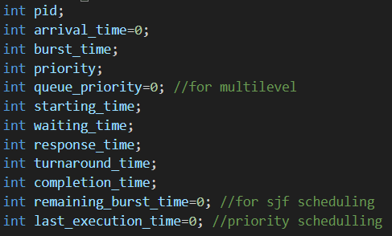

# CPU-Scheduling

<b>Project Title:</b> 
CPU Scheduling Simulator

<b>Project Description:</b>
This program is designed to simulate and compare various CPU scheduling algorithms including First-Come-First-Serve (FCFS), Shortest Job First (SJF), Priority Scheduling, and Round Robin (RR). It also implements a Multilevel Queue Scheduling mechanism. This simulator helps in understanding and comparing the performance of different scheduling algorithms in terms of metrics like waiting time and turnaround time. 

<b>How to Run the Project</b>
Dependencies:
1. A C++ compiler (e.g., g++, clang++)
2. Standard Template Library (STL) 

<b>Input:</b>
1. Choose whether to use a predefined process set or enter details manually.
2. Provide the time quantum for Round Robin scheduling if required.

<b>Output:</b>
1. Details of processes after applying the most appropriate scheduling algorithm.
2. Comparison of average waiting and turnaround times for all algorithms.
3. Multilevel Queue Scheduling details.
4. Gantt Chart representation of process execution(works smoothly for non premtive processes)

<b>Theory:</b>

Before execution of every scheduling, the process set is sorted on the basis of arrival time. If arrival time is same then on basis of PID.

<u>First Come First Serve(FCFS)</u>

Processes are executed in the order they arrive. The processes are arranged in the increasing order of their arrival time, we'll take variable t=0, we'll iterate over process and check for arrival time. If the current time t is less than the arrival time of the process it implies that cpu is waiting for next task which might arrive after time+x time later, so we jump on to the arrival time and set current time t=arrival time, then we calculate completion time, etc for that process.
If t is more than the arrival time of the process, this means that another process is happening so the current process is added to ready queue, then when that another process ends, current process is implemented and it's details (starting time, completion time, etc) are calculated on the basis of the formulas given in the resources used.
Example: if t=4 but arrival time for next process is 1, since fifo algo is followed, process with arrival time 1 will be implemented after process with arrival time 0 and start time will be 4.

<u>Shortest Job First(SJF)</u>

In this code, we take two vectors which are same, both are arranged in increasing order based on their arrival time, then we iterate over them with two pointers. We match timer t=0 (time=0 in the code) with the arrival time of the processes. If all the processes have same arrival time then no complexities are inolved as processes are scheduled on the baisis of their burst times. lowest executes first.
If arrival times are different, then the timer goes on increasing by 1 initially (until all processes have arrived). On every step it will check if any process has arrived or not as well as it will check for process with shortest remaining burst time. 
(The burst time will keep on changing for processes that have executed even for 1 second before preemption)

So while we start at t=0, if any process has arrived we start implementing it(set starting time) and after a second we decrement the burst time of the process by 1 then if  another process has arrived, the second pointer checks again for which process has the shortest remaining burst time(including the current process). If the same process has shortest remaining burst time then it continues otherwise it is preempted and the process with shortest burst time will be executed (here executed means the data has been set) then it executes for 1 unit of time again and checks if another process has arrived and whether it has smaller burst time or not. When the remaining burst time of the process becomes zero, it is erased from the ready queue, or remaining_processes_set as I've used in the code. If the process is completed, update its completion time and remove from the remaining_processes. As all ready queue becomes empty, it means all processes are done so the while loop stops. And according to formulas waiting times are also calculated, with all the information combined one can figure out how were the processes executed. And the arrival, completetion times are calculated in the same way as they were calculated in the earlier method of FCFS scheduling.

<u>Priority Scheduling</u>

It is implemented in the same way as SJF stated above, but the second pointer points at priority value of the process. The preemptive priority scheduling algorithm assigns the CPU to the process with the highest priority (smallest priority number) at any given time. This can cause a process to be preempted if a new process arrives with a higher priority. The given code implements preemptive priority scheduling with aging to prevent starvation.
Aging is immplemented using update_priorities function which increments priority of process by 1 (priority number-1) if the process hasn't been executed for more than three cycles (these numbers are personal choices as I have executed processes with time values less then 50, they can be changed if the algorithms are used for large scale practical purpose). This helps in reducing starvation. If there is no current_process or the process has a higher priority than the current process, update current_process to this process. 
If no process is found that can be executed (i.e., current_process is nullptr), increment the time and continue to the next iteration of the loop. If a process is found and it is being executed for the first time (remaining_burst_time equals burst_time), set its starting time to the current time. Decrement the remaining_burst_time of the current_process and increment the time.

Upon each iteration, the algorithm selects the process with the highest priority (smallest priority number) that has arrived. If multiple processes have the same priority, the process with the earliest arrival time is selected.
In the same way as SJF, the further details are also calculated.

<u>Round Robin</u>

This is a combination of sjf and fcfs. It follows a clock, which is time quantum. The processes are first sorted based on their arrival times using sort_process_set.
We initialize time to 0, which represents the current time.
A ready_queue is initialized to keep track of the indices of the processes that are ready to execute.
For each process in processes_set, the remaining burst time is initialized to the burst time of the process.
Main Scheduling Loop:

The loop continues until all processes have been executed and the ready_queue is empty. We check for processes that have arrived and add them to the ready_queue. If the ready_queue is empty (no process is ready to execute), increment the time and continue to the next iteration of the loop.
The first process in the ready_queue is selected as the current_process. If the current_process is being executed for the first time, its starting time is set to the current time. The current_process is allowed to execute for up to time_quantum units or until it finishes execution, whichever comes first. This execution time is stored in execution_time.
The remaining burst time of the current_process is decremented by execution_time, and the time is incremented by execution_time.
After executing the current_process, we check again for any new processes that have arrived during the execution and add them to the ready_queue. If the current_process has finished executing (remaining burst time becomes zero), its completion time, turnaround time, and waiting time are calculated. If the current_process has not finished executing, it is placed back into the ready_queue to wait for its next turn.
Once all processes are completed, return the processes_set with the updated details (start time, completion time, turnaround time, waiting time).

<u>Multilevel Queue</u>

In this we create 2 vectors/sets. Processes are divided into two queues: high priority and low priority. The remaining burst time of each process is initialized to its burst time.
Processes in the low priority queue are scheduled using the FCFS algorithm.
FCFS schedules processes based on their arrival times, with no preemption.

Processes in the high priority queue are scheduled using the round-robin algorithm with a fixed time quantum.
Round-robin scheduling allows each process to execute for a time slice, ensuring fair CPU allocation among processes.

For each queue, the algorithm prints the details of the processes and calculates the average turnaround time and waiting time.
Turnaround time is the total time taken from the arrival to the completion of the process.
Waiting time is the total time a process spends waiting in the ready queue.

queue_priority=0 means process is of hightest priority, any other number means low priority for this code.
On implementing it on very large scale(like normal computers) the process are foreground(have higher priority) and background processes. The queues are formed based on different processes such as
System processes
Interactive processes
Interactive editing processes
Batch processes
Student processes

These would be properly implemented for real life processors.

<b>Implementation</b>

The schedulings can be implemented by taking into account various criterion. In this code, compare_scheduling_algorithms compares the average waiting time for every scheduling algorithm, we thus the commands in int main() can easily be changed based on which criteria we or the cpu wants.
Ex. here if through compare_scheduling_algorithms function if I get returned value of string as FCFS, that means FCFS scheduling gives me least average waiting time for the processes so I will implement fcfs algorithm for future processes which are of similar type (we can find similarity through other codes or through combining scheduling with ML or AI or through any other process). 
Also if I get least average waiting time from FCFS I'll give more weightage to details of the processes gone through fcfs.

Another criteria the cpu can take would be priority, for some process which are important, we can implement RR or Priority (that's what MUltilevel does); for small processes we can use commparison.
Moreover these can also occur simultaneously if we increase number of processors. Eg. each processor would pick one schdeuling criteria and they will all execute it in the same time then lastly compare them.

There are a numerous ways these algorithms can be used to implement processes, for real life application. 

<u>Flexibility and Adaptability:</u>

The comparison and selection of scheduling algorithms based on specific criteria demonstrate the flexibility and adaptability of the system. By continuously monitoring the performance of different algorithms, the system can dynamically switch to the most efficient one for a given workload, ensuring optimal CPU utilization and minimal waiting time.
Learning and Improvement:

Integrating machine learning (ML) or artificial intelligence (AI) can further enhance the scheduling process. By analyzing historical data, the system can learn which scheduling algorithms perform best under certain conditions, improving future scheduling decisions. This learning-based approach can adapt to changing workloads and system states, continuously optimizing performance.
Scalability:

The approach can scale with the number of processors. In a multi-processor environment, each processor can implement a different scheduling algorithm simultaneously. This parallel execution can significantly reduce overall waiting time and turnaround time, as each processor handles a portion of the workload according to the most suitable scheduling criteria.
Custom Scheduling Policies:

The system can be designed to implement custom scheduling policies based on various factors such as process type, user requirements, or system load. For example, critical system processes can be given higher priority, while less critical background tasks can use algorithms that minimize CPU usage.

<b>Real-Time Constraints:</b>
For real-time systems, meeting deadlines is crucial. Scheduling algorithms can be evaluated based on their ability to handle real-time constraints, ensuring that critical tasks are completed within their specified time frames. This is essential for applications such as medical devices, automotive systems, and industrial automation.

Thank you 

Resources followed: Youtube (https://www.youtube.com/playlist?list=PLBlnK6fEyqRitWSE_AyyySWfhRgyA-rHk)
                    Geeks for geeks
                    Book--> Operating Systems: Three Easy Pieces
                    Other online media
